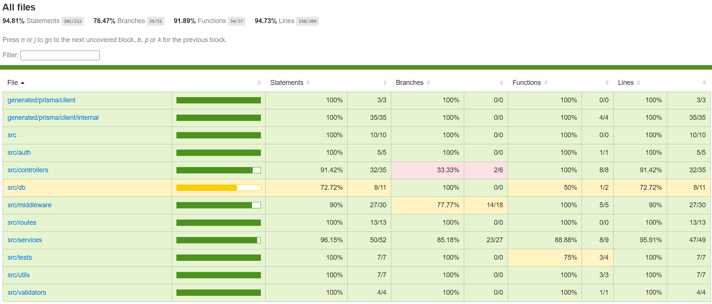

# ToDoList - API 
_Progettato da Ossama Nadifi per Mr. Apps - 2026_
## Descrizione

Il progetto prevede la progettazione e lo sviluppo di una API RESTful dedicata alla gestione di task personali. E' prevista la possibilità di autenticarsi al servizio, e successivamente di svolgere le CRUD relative alle task.

## Stack tecnologico

- **Node.js**: Runtime JavaScript utilizzato per lo sviluppo lato server.
- **Express.js**: Framework web leggero e minimalista per la creazione di API e applicazioni backend con Node.js.
- **JWT (JSON Web Token)**: Sistema sicuro per autenticazione e autorizzazione basato su token.
- **Prisma**: ORM di nuova generazione per la gestione e l’interazione con il database.
- **PostgreSQL**: Database relazionale open source potente, affidabile e scalabile.
- **Zod**: Libreria di validazione schema orientata a TypeScript per il controllo dei dati.
- **Vitest**: Framework moderno e performante per il testing di applicazioni JavaScript e TypeScript.
- **JSDoc**: Strumento per la generazione automatica della documentazione del codice tramite commenti strutturati.

### Motivazioni
Non avendo particolare familiarità con lo sviluppo di API in Node.js, lo stack tecnologico è stato definito tenendo conto di diversi fattori. In particolare, trattandosi di un servizio web di dimensioni ridotte, le tecnologie sono state scelte privilegiando l’**efficienza**, la **semplicità d'implementazione** e la **popolarità**. Quest’ultimo aspetto ha permesso di reperire facilmente documentazione e risorse utili per l’implementazione delle funzionalità richieste, incluse eventuali estensioni.

## Funzionalità

- **Registrazione**: Inserendo i dati dell'utente secondo lo schema predefinito, sarà possibile registrarsi al servizio. Il controllo sui dati in input avviene tramite un middleware dedicato e uno schema ZOD.

- **Autenticazione**: Inserendo i dati dell'utente secondo lo schema predefinito, sarà possibile autenticarsi al servizio. Il controllo sui dati in input avviene tramite un middleware dedicato e uno schema ZOD. Tutte le operazione relative all'account e alle task necessitano di autenticazione, garantita nel momento in cui si effettua l'accesso grazie alla generazione di un token JWT, associato successivamente in modo automatico ai cookies del client, o in alternativa come header **Authorization** secondo lo schema Bearer.

- **Ottieni dati utente**: Una volta autenticato, l'utente può ottenere le informazioni correlate al suo profilo. Il controllo sull'autenticazione avviene tramite un middleware dedicato.

- **Crea task**: Una volta autenticato, l'utente può creare una nuova task. Per l'inserimento della nuova mansione è necessario rispettare uno schema predefinito. La validazione dei dati in input è garantita grazie alla presenza di un middleware dedicato ed un modello ZOD.

- **Aggiorna task**: Una volta autenticato, l'utente può aggiornare una task precedentemente creata dal suo profilo. L'autenticazione è garantita dal middleware dedicato, ma sono comunque presenti diversi controlli per garantire la presenza della task e la paternità dell'utente.

- **Cancella task**: Una volta autenticato, l'utente può cancellare una task precedentemente creata dal suo profilo. L'autenticazione è garantita dal middleware dedicato, ma sono comunque presenti diversi controlli per garantire la presenza della task e la paternità dell'utente.

- **Ottieni task**: Una volta autenticato, l'utente può ottere i dati legati ad una specifica task. Ogni utente può visualizzare solamente le task associate al suo profilo.

- **Ottieni tutte le  task**: Una volta autenticato, l'utente può ottere i dati legati a tutte le task associate al suo account.

## Endpoint
Seguendo lo schema della documentazione JsDoc, gli endpoint sono stati organizzati in questo modo:
### Auth
- POST `/auth/register` → **Registrazione**
- POST `/auth/login` → **Autenticazione**

### Account
- GET `/account` → **Ottieni dati utente**

### Orders
- POST `/tasks` → **Crea task**
- PUT `/tasks/{id}` → **Aggiorna task**
- DELETE `/tasks/{id}` → **Cancella task**
- GET `/tasks/{id}` → **Ottieni task**
- GET `/tasks` → **Ottieni tutte le task**
- GET `/tasks?page=*&pageSize=*` → **Ottieni tutte le task applicando una paginazione con 'page' pari al numero della pagina e 'pageSize' che rappresenta la dimensione di queste**

## Data model
Il servizio è stato definito considerando due principali modelli di dati:

### User
- `id: string` → ID utente in formato _uuid_
- `name: string` → nome completo utente
- `email: string` → email utente
- `pswd: string` → password utente

### Task
- `id: string` → ID task in formato _uuid_
- `title: string` → titolo associato alla task
- `description: string` → descrizione task
- `createdAt: dateTime` → timestamp della creazione della task
- `state: ENUM("PLANNED", "COMPLETED")` → Enum per definire lo stato della task
- `AuthorId: string` → ID creatore task in formato _uuid_

## Esecuzione
### Esecuzione API
L'esecuzione è stata unificata grazie all'implementazione di Docker, tramite il quale è possibile eseguire il servizio con un solo comando:
```
docker compose up --build
```
Il servizio sarà raggiungibile al seguente indirizzo:
```
http://localhost:8080
```
con la documentazione dell'API a questo link una volta avviato il Docker:
```
http://localhost:8080/docs
```
_* L'implementazione dell'intefaccia Swagger.Ui è stata svolta senza considerare il funzionamento su di essa, ma solamente la visualizzazione dei vari dati. *_
### Esecuzione Test
I test sono stati svolti utilizzando Vitest, e per eseguirli è necessario eseguire i seguenti passaggi: 
- **Installare le dipendenze**
```
npm install
```
- **Generare i file Prisma**
```
npx prisma generate
```
- **Eseguire lo scipt**
```
npm run coverage
```


L'attività di testing ha prodotto risultati complessivamente molto positivi, garantendo un elevato livello di copertura del codice. Nonostante non sia stato raggiunto il valore completo, la gran parte dei moduli principali raggiunge una copertura del superiore al 90%, indicando come le funzionalità fondamentali siano state testate in maniera esaustiva.